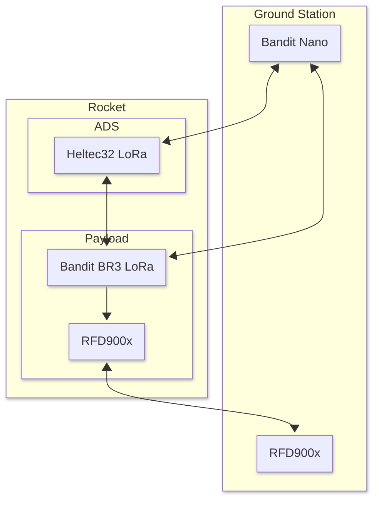

# Hardware

This directory contains the hardware design details and notes for the project. PCB design is done using KiCad.

## Communication Overview

```mermaid
---
config:
  look: neo
  theme: mc
---
flowchart TD;
  subgraph Ground_Station["Ground Station"]
    n1["Bandit Nano"]
    n2["RFD900x"]
  end

  subgraph Rocket["Rocket"]
    subgraph ADS["ADS"]
      n3["Heltec32 LoRa"]
    end

    subgraph Payload["Payload"]
      n4["Bandit BR3 LoRa"] --> D["RFD900x"]
    end
  end


    n1 <--> n4
    n1 <--> n3

    D <--> n2
    n3 <--> n4
```
