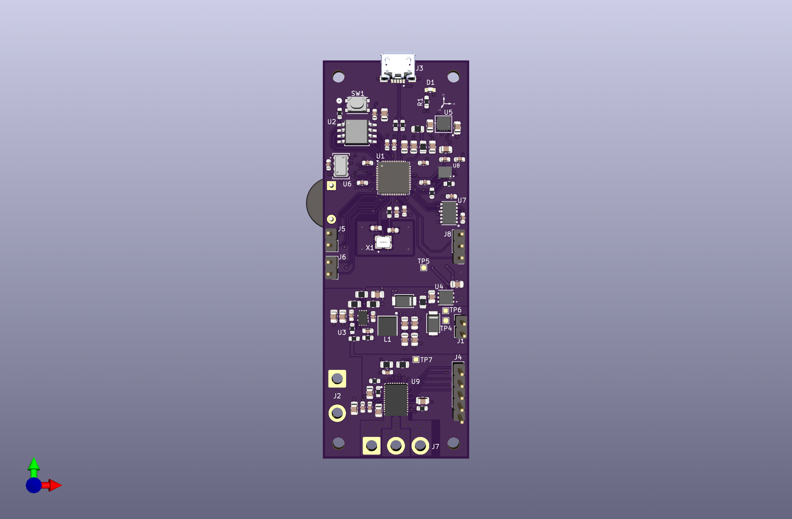
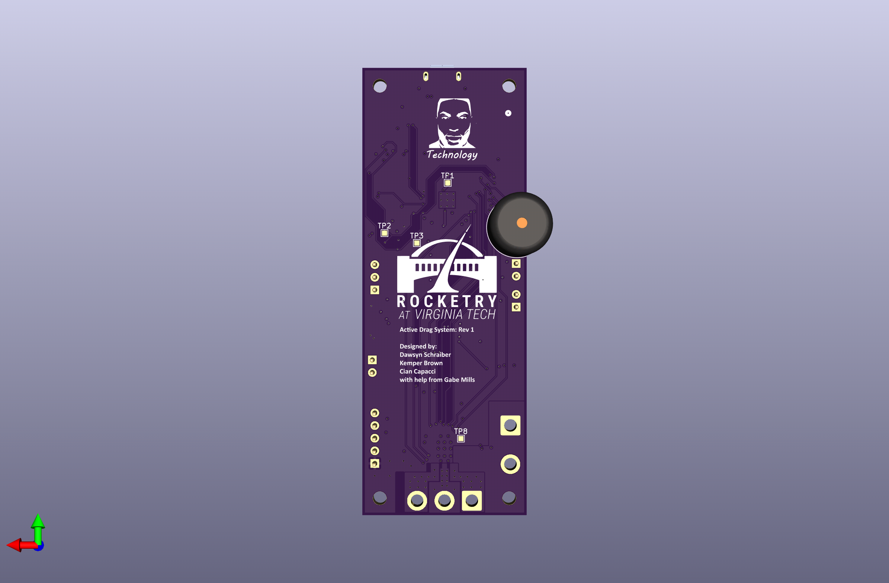
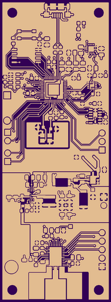
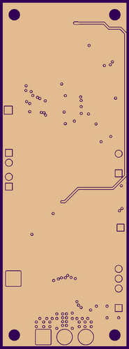
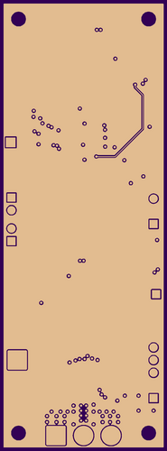
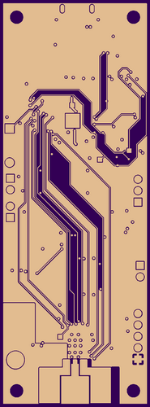
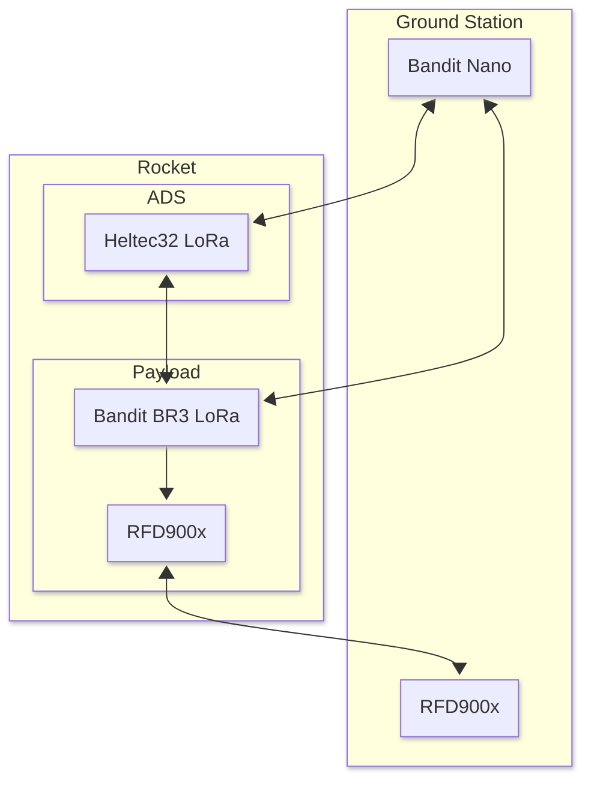

# Hardware

This directory contains the hardware design details and notes for the project. PCB design is done using KiCad.

## Active Drag System

The Active Drag System (ADS for short) is a multifaceted project that employs a combination of a mechanical rack and pinion with a digital servo to simultaneously actuate a set of four, symmetric air brakes on the rocket. The electronics that reside in this system are primarily featured on a custom, 4-layer RP2040-based PCB.

High-Level Component View:
- Raspberry Pi RP2040 dual ARM Cortex-M0+ MCU
- Winbond W25Q128JVSIQ serial flash memory
- Measurement Specialties MS5607 Micro Altimeter Module
- Analog Devices ADXL375 3-Axis Digital MEMS Accelerometer
- TDK InvenSense IIM-42653 6-Axis Digital MEMS IMU
- Memsic MMC5983MA 3-axis magnetometer
- Texas Instruments MCT8316Z0RRGFR Integrated FET 8A Brushless Motor Driver

3D Rendered Views of a Completed Board via KiCad:

The following are images produced by the gerbers provided to OSH Park, LLC for PCB fabrication in the layer order of 1 - 4.

## Communication Overview

